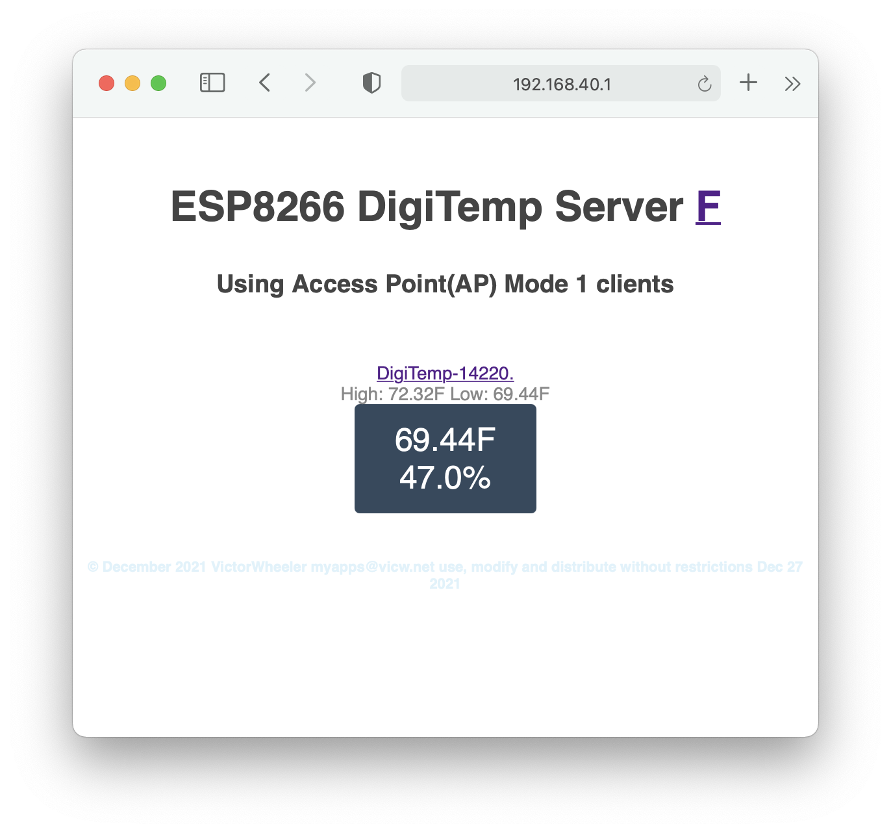
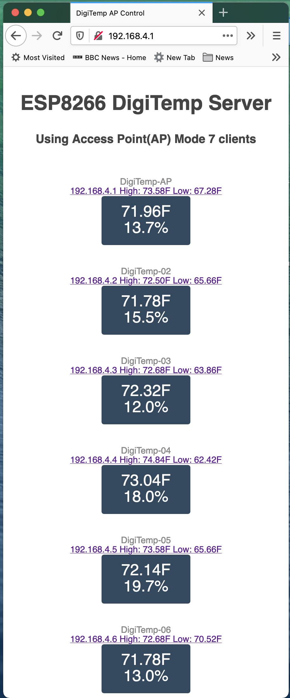

# DiGiTempESP_V4
Build a network of DHT temperature and humidity sensors using the ESP8266WiFi.
 
Monitor several ESP8266+DHT (DHT22, DHT11 ...) sensors from a single web page.
This version can auto detect the sensor type and create or connect to an access point that collects the Temperature And Humidity from up to 7 clients the information is displayed in a single web page. If the device detects that the AP exists it becomes a client publishing its own sensor data that the AP can collect.

 Single Sensor 

After setting up the first ESP8266 + DHT22 temperature sensor I built a second for the other side of the room I wanted to monitor both from a single device like a smart phone so I setup one of the devices as an access point capable of serving a WEB page on the local network this page displays one or more of the temperature sensors. Each device registers it's hostname using mDNS I used DigiTemp for the host name allowing access of the monitoring device using the URL "http://DigiTemp.local".  I have tested with 6 sensors the maximum number of concurrent connections stated for ESP8266WiFi is 8 therefore it should work with up to 7 sensors leaving 1 connection for the smart phone, tablet or PC.    
 
Note: I replaced the Adafruit DHT Library DHT.h and DHT.cpp with modified local files to allow auto sensing of the DHT sensor type. Now I can easily swap sensors without re programming the ESP.

Files
 - DHT.h,cpp		Modified Adafruit DHT files
 - DigiTempESP_V4.h	Common functions 
 - DigiTempESP_V4.ino	Arduino sketch launching point
 - Sensor.h,cpp		Wrapper for the DHT sensor files
 - UserSettings.h	Changeable setting such as IP, username, password ... 

Some common functions
 - BinLED		Built in LED
 - TimeCheck		Monitor time elapse
 - Uptime		Monitor time from last boot

Libraries
 - Adafruit_Unified_Sensor
 - ESP8266mDNS
 - ESP8266WebServer
 - ESP8266WiFi

 6 Sensors
 
 
